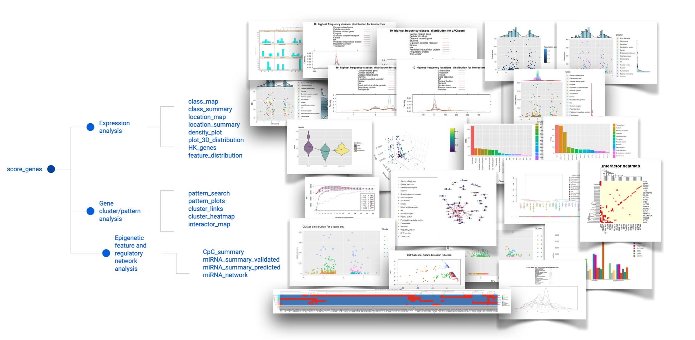

```{r setup, include=FALSE}
knitr::opts_chunk$set(echo = TRUE)
```

```{r message=FALSE, warning=FALSE}
library(OmicInt)
```

## 1. Package Overview

*OmicInt* is an R package developed for an in-depth exploration of significantly changed genes, gene expression patterns, and associated epigenetic features as well as miRNA environment. The package helps to assess gene clusters based on their known interactors (proteome level) using several different resources, e.g. UniProt [1] and STRINGdb [2]. Moreover, *OmicInt* provides an easy Gaussian mixture modelling (GMM) [3,4] pipeline for an integrative analysis that can be used by a non-expert to explore gene expression data. Specifically, the package builds on a previously developed method to explore gene networks using significantly changed genes, their log-fold-change values (LFC), and the predicted interactome complexity [5]. This approach can aid in studying specific gene networks, understanding cellular perturbation events, and exploring interactions that might not be easily detectable otherwise [5]. To this end, the package offers many different utilities to help researchers quickly explore their data in a user-friendly way where machine learning is made easily accessible to non-experts (Fig.1&2).
<br>
<br>
Before starting the analysis the user must ensure that the supplied data is in the right format. There are several different options to prepare a data frame (CSV format) that contains all relevant experimental information (Fig.1; Eq.1-4). Depending on the selection, the downstream analyses will provide interactive graphs and maps (Fig.2).
<br>
<br>
The key analytical parameter in the machine learning pipeline and exploratory analyses is a specific score, namely $LFC_{score}$, which can have a different derivation depending on the selected parameters (Eq.1-3). The user has several options to select from since the equations were expanded with additional data based on the earlier multi-*omics* equation [5]. The score $\alpha$ values are downloaded automatically from curated database images via text mining to retrieve, update, and integrate data in an easier format (i.e., database image) for the analyses. Databases used include Disgenet [6], Uniprot [1], and STRINGDB [2]. For example, $\alpha_{asoc}$ score describes how a gene associates with a specific pathology based on different curated resources as described earlier [6]. This value allows to infer how strongly a gene is linked to a disease or pathological phenotype ranging from 0 (no link) to 1 (the strongest association) (Eq.1). Similarly, $\alpha_{spec}$ captures how specific a gene is when describing the pathology (Eq.2). This is defined by the user as either "association_score" or "specificity_score" when selecting the type of the equation for $LFC_{score}$. Scores $\beta_{cell}$ and $\gamma_{prot}$ are scaled values for single cell and proteome data, respectively. That is, $\beta_{cell}$ has to be provided by the user if they have such experimental information integrated where a gene value from a single cell data cluster is extracted using a pseudo-bulk differential gene expression approach. The LFC scores from pseudo-bulk data need to be scaled according to the equation 4. The same approach should be applied when calculating $\gamma_{prot}$ for protein (corresponding gene) values. 
<br>
<br>
$LFC_{score}=LFC(1+\alpha_{asoc}+\beta_{cell}+\gamma_{prot})$
<br>
<br>
**Equation 1**. $LFC_{score}$ equation where LFC - Log Fold Change, base 2; $\alpha_{asoc}$ - disease association score; $\beta_{cell}$ - scaled single cell LFC; $\gamma_{prot}$  - scaled proteome LFC.
<br>
<br>
$LFC_{score}=LFC(1+\alpha_{spec}+\beta_{cell}+\gamma_{prot})$
<br>
<br>
**Equation 3**. $LFC_{score}$ equation where LFC - Log Fold Change, base 2; $\alpha_{spec}$ - disease specificity score; $\beta_{cell}$ - scaled single cell LFC; $\gamma_{prot}$  - scaled proteome LFC.
<br>
<br>
$LFC_{score}=LFC(1+\sqrt{\alpha_{asoc} \cdot \alpha_{spec}}+\beta_{cell}+\gamma_{prot})$
<br>
<br>
**Equation 3**. $LFC_{score}$ equation where LFC - Log Fold Change, base 2; $\alpha_{asoc}$ and $\alpha_{spec}$  are integrated using geometric average score; $\beta_{cell}$ - scaled single cell LFC; $\gamma_{prot}$ - scaled proteome LFC.
<br>
<br>
$LFC_{scaled}=\frac{LFC_{gene}}{LFC_{median}}$
<br>
<br>
**Equation 4**.  $\beta_{cell}$ or $\gamma_{prot}$ scaling example where $LFC_{gene}$ - gene specific value and $LFC_{median}$ - median value for all available LFC per specific condition and gene set.
<br>
<br>
<br>
<br>
*OmicInt* provides many other valuable tools to map interactome using information on the target cellular location or protein class/functional type. In addition, density functions allow for an in-depth assessment of gene distributions which may hint at potential functions or dominating processes within a specific condition. Epigenetic feature (CpG islands, GC%) and miRNA exploration tools also provide additional information on the epigenome and non-coding regulome which might be relevant for some genes and conditions, especially if a higher enrichment of these patterns can be found.
<br>
Currently, the analyses are only available for Human data sets.
<br>
<br>

## 2. Package functions and tutorial

<br>
<br>

## 2.1. Preprocessing

<br>
<br>
Data pre-processing relies on the *score_genes* function that collects data from STRINGDB [2] and disease association databases to scale and prepare additional score integration. Several key parameters should be provided; *data* parameter requires a data frame containing gene names as row names and a column with LFC values. The example is provided in Figure 1; parameter *alpha* has a default value set as "association" which gives a score from 0 to 1 based on how strongly a gene is associated with a pathological phenotype; other options are "specificity" - to give values based on how specific a gene is when describing a disease and "geometric" - to give a geometric mean score of both association and specificity. In addition, it is possible to add weighed single cell and proteomics data by selecting additional parameters. Parameter *beta* is set to have a default value as  FALSE; if TRUE, please supply data with a column *beta* that contains information on gene associations from single cell studies. Similarly, parameter *gamma* has a default value FALSE; if TRUE, the user needs to supply data with a column *gamma* that contains information on gene associations from proteome studies.
<br>
<br>
The function returns a data frame for the downstream analyses.
<br>
<br>
{width=80%}
{width=80%}
<br>
<br>
```{r}
#data<-score_genes("data.csv")
#head(data)

#   Symbol log2FoldChange       pvalue Interactors Association_score
#1   SAR1A      -2.187773 2.656521e-05          24         0.0000000
#2 C6orf62      -2.674213 1.691567e-07           0         0.0000000
#3     AXL      -2.786508 1.739595e-04           2         0.3230769
#4   BICC1      -3.598553 2.738887e-04           3         0.3000000
#5  CAPZA1      -1.732784 2.321835e-04          66         0.3789474
#6   TXNIP       1.460629 7.347205e-05          30         0.3000000
#  Specificity_score  LFCscore
#1             0.000 -2.187773
#2             0.000 -2.674213
#3             0.590 -3.686764
#4             0.751 -4.678119
#5             0.601 -2.389418
#6             0.631  1.898818
```
<br>
<br>

## 2.2. Expression overview and exploratory analyses

<br>
<br>
Function *density_plot* plots a density plot for gene expression data prepared by the *score_genes* function. The plots can be used for a quick assessment of the overall parameters.
<br>
<br>
The plots allow evaluation of how hey parameters, such as LFC, $LFC_{score}$, and disease association or specificity scores, associate with the highest frequency protein classes and cellular locations. For example, the most frequent protein classes may have specific distribution patterns hinting at cellular processes. Similarly, examining distributions for cellular locations might highlight the most involved and/or affected cellular strictures.

<br>
<br>
<br>
<br>
```{r}
#density_plot(data)
```
<br>
<br>
<br>
<br>
Function *feature_distribution* also provides a way to visualise main feature distributions through density plots combined with $LFC_{score}$ and interactor number scatter plots. These plots allow to quickly assess if there are any dependencies between $LFC_{score}$ and the interactor numbers. These plots also help to see if any obvious gene clusters emerge. 
<br>
<br>
The function might issue some warning if the data points were missing or too few for density plotting; however, it does not affect the overall visualisation.
<br>
<br>
```{r}
#feature_distribution(data)
```
<br>
<br>
<br>
<br>
Function *plot_3D_distribution* allows to explore 3D distribution between the number of interactors, $LFC_{score}$ and p.adj values. In addition to providing a data parameter, the user can select how to color data points depending on association or specificity score (e.g., selecting "specificity")
<br>
<br>
This analysis can help identify specific clusters for the expression patterns and interactors based on the significance of how the gene expression changed in a given condition. In addition, coloring based on gene association or specificity in the context of diseases can help capture additional patterns in the data.
<br>
<br>
```{r}
#plot_3D_distribution(data)
```
<br>
<br>
<br>
<br>
Function *class_summary* provides analysis on main protein classes  where a barplot  helps to visualise the class distribution. Similarly, the function *location_summary* summarises the location distribution data.
<br>
<br>
```{r}
#class_summary(data)
```
<br>
<br>
```{r}
#location_summary(data)
```
<br>

<br>
Function *location_map*  allows the visualisation of how the highest and lowest LFCscore genes cluster based on protein cellular location data. The user can specify the number of the top and lowest genes to consider. The function returns a dendogram generated based on $LFC_{score}$. The "euclidean" method is used for distance calculation and the "Ward.D2" method - for hclust generation. 
<br>
<br>
Gene labels are colored to indicate major clusters where a hclust generated cluster number is doubled. In addition, to achieve a finer separation of lower dendogram branches the following equation is used to set the height for color differentiation of different branches (Eq.5). This equation takes mean value for hclust function height calculation and multiplies by dendrogram cluster number scaled twice. 
<br>
<br>
The plot also provides cellular location visualisation for each gene.
<br>
<br>
$H_{dendogram}=\frac{hclust_{height}}{hclust_{n}}\cdot dendogram_{cluster\_number}\cdot2 $
<br>
<br>
**Equation 5**.  $\beta_{cell}$ or $\gamma_{prot})$ scaling example where $LFC_{gene}$ - gene specific value and $LFC_{median}$ - median value for all available LFC per specific condition and gene set.
<br>
<br>
<br>
```{r}
#location_map(data)
```
<br>
<br>
<br>
<br>
Similarly, the function *class_map* provides visualisation of how the highest and lowest $LFC_{score}$  genes cluster based on protein class. In addition to a data frame generated by *score_genes*, the function also requires a *num* parameter to specify the number of genes to consider from top upregulated and downregulated genes, if this option is not selected all genes will be used.
<br>
<br>
<br>
<br>
```{r}
#class_map(data)
```
<br>
<br>
<br>
<br>
<br>
<br>
<br>
*HK_genes* function provides a convenient overview of the house keeping genes and allows to check if these genes varied throughout conditions. Depending on the number of conditions separate plots will be generated. Inspecting housekeeping genes can help understand if there was any significant variation between samples groups which might have arisen from biological or technical variation.
<br>
<br>
```{r}
#HK_genes(data)
```
<br>
<br>
<br> 

## 2.3. Cluster analyses

<br>
<br>
Function *cluster_genes* helps to select an optimal number of clusters and a model to be fitted during the EM phase of clustering for Gaussian Mixture Models. The function provides summaries and helps to visualise  gene clusters based on generated data using *score_genes* function. Weighed gene expression is clustered based on the interactome complexity, i.e., the number of known interactors according to STRING DB, with a cutoff of 700 for score threshold. The function also provides scatter plotting and dimension reduction plots to analyse the clusters and features in your data. 
<br>
<br>
Required parameters included a data data frame containing processed expression file from *score_genes* with $LFC_{score}$,a *max_range* number for cluster exploration during model selection (the default value is 20 clusters), *clusters* parameter can be provided for the number of clusters to test not based on the best BIC output (user then also needs to supply *modelNames*), the *modelNames* parameter can only be supplied when *clusters* are also specified, this option will model based on the user parameters.
<br>
<br>
The function not only provides summarised modelling output and plots but also returns a cluster assignment data frame for clusters which can be used by more advanced users in other machine learning pipelines or data comparison studies.
<br>
<br>
The user is advised to set seet before using the function to get reproducible results.
<br>
<br>
```{r}
#model_report<-cluster_genes(data)
```
```{r}
#head(model_report)
```
<br>
<br>
```{r}
#Best BIC values:
#             VVI,6        VVI,7        VVI,5
#BIC      -2481.986 -2483.544400 -2485.429861
#BIC diff     0.000    -1.558131    -3.443592
```
<br>
<br>
```{r}
#       Interactors  LFCscore Cluster Symbol
#CAPZA1          66 -2.389418       1 CAPZA1
#RAB31            0 -2.542398       2  RAB31
#UBE2B            2 -2.061383       2  UBE2B
#YWHAG           21 -2.111448       1  YWHAG
#ENAH            29 -2.207514       1   ENAH
#PPP3CA          51 -3.500322       1 PPP3CA
```
<br>
<br>
<br>
<br>

<br>
<br>
Function *cluster_links* provides the same Gaussian Mixture Modeling pipeline as *cluster_genes*; however, instead of the interactor number clustering, the user can select  a specific disease score *type* (default "association"). This parameter can define either the association or specificity for a disease, i.e., if the gene has known links to disease phenotypes and how specific it is when describing a pathology. 
<br>
<br>
The function also provides scatter plotting and dimension reduction plots to analyse the clusters and features in the data. 
<br>
<br>
An additional output is a model report summarising the cluster assignments  which can be used in other modelling analyses.
<br>
<br>
Function *pattern_search* explores the occurrences of specific patterns in gene sets, specifically it searches each condition under investigation for emerging patterns (e.g., if multiple conditions are provided) to group genes that changed in a similar manner.
<br>
<br>
The search algorithm works by first generating potential pattern search depending on the number of subclasses. For example, if a condition has several subclasses as is in the case example, where Condition 1 has a healthy group, hypertensive, and CKD patients. Then potential pattern scenarios are generated: "up-up-up" or "down-up-down". Then each gene overall expression is calculated using geometric mean across all conditions, this gives a basal line against which an individual gene expression value is weighed to deduce if it is in a 'up' or 'down' state.
<br>
<br>
Comparing against a basal line is a more universal approach rather than performing a pair wise comparisons which may not be effective for multiple subclasses or complex interactions. Averaging expression using a geometric mean method provides common grounds for comparison taking into account all the extreme values which might result either from biological or technical effects. It is important to note, that taking average might not be optimal in all cases, but in a balanced experiment it should provide additional information for the downstream analyses.
<br>
<br>
The function returns how many genes are identified for each pattern type across conditions.
<br>
<br>
<br>
```{r}
# "Condition subclasses"
#
#[1] "CKD"          "healthy"      "hypertension"
#
#pattern_search(data, meta)
#
#    
#               Gene count
#down_down_down          0
#down_down_up         2679
#down_up_down          670
#down_up_up           1076
#up_down_down         5503
#up_down_up           2550
#up_up_down           2856
#up_up_up              361
```
<br>
<br>
The returned gene list contains groups of genes for different types of patterns. 
<br>
<br>
```{r}
#$up_up_down
#   [1] "A4GALT"        "AASDHPPT"      "AATF"         
#   [4] "ABCC11"        "ABCC9"         "ABCG2"        
#   [7] "ABHD13"        "ABHD2"         "ABI3"         
#  [10] "ABI3BP"        "ABITRAM"       "ABO"   
```
<br>
<br>
This analysis can be followed by *pattern_plots* which allows to explore distributions for a selected pattern group. The user must provide a subsetted data frame and low/high parameters to select a specific range. The selection is needed because in some instances the expression values might differ significantly and visualising  all data points will prevent exploring any meaningful subsets.
<br>
<br>
The outputs allow to assess how genes distribute in a subset for different conditions and how the individual gene values vary in the selected subgroup. 


<br>
<br>
<br>
<br>
Function *cluster_heatmap* uses information mined from STRING database [2] to map experimental, referenced, and inferred interactions to see if there are any interactors in the set of significantly changed genes. This heatmap provides clustered visualisation of all genes and the genes that have shared interactions.
<br>
<br>
This information can allow to quicklyassess how many genes in a condition that changed significantly might be part of the same regulatory cluster. 
<br>
<br>
<br>
<br>
```{r}
#cluster_heatmap(data)
```
<br>
<br>

<br>
<br>
<br>
<br>
Function *interactor_map* helps to visualise information mined from STRING database [2] and  map direct and referenced interactions to see if there are any interactors in the set of significantly changed genes and how they are linked.
<br>
<br>
```{r}
#interactor_map(data)
```
<br>
<br>

<br>
<br>

## 2.4. Epigenomics integration

<br>
<br>
Function *CpG_summary* provides information on genes with CpG islands and GC content. The function checks genes against known CpG islands and provides various plots to assess emerging data features. CpG islands were retrieved from the data available with Genome Reference Consortium (Human Build 38) [6], this information was cross-referenced with Ensembl database [7] to retrieve overlaps between CpG islands and genes. The function provides a number of analytical plots to assess whether CpG profile (via GC %) has any influence on expression, interactor number, disease specificity and disease associations. All this information is provided in the context of the assigned protein classes/functional groups. Such analysis provides additional insights into the complex interplay between the genome, transcriptome, and epigenome. In addition, the function outputs a data table that contains genomic locations and gene information based on Ensembl so that the user can perform additional analyses.
<br>
<br>
```{r}
#cpg_genes<-CpG_summary(data)
#head(cpg_genes)
```
<br>
<br>

<br>
<br>
```{r}
#   Symbol log2FoldChange       pvalue Association_score
#1   SAR1A      -2.187773 2.656521e-05         0.0000000
#2 C6orf62      -2.674213 1.691567e-07         0.0000000
#3     AXL      -2.786508 1.739595e-04         0.3230769
#4   BICC1      -3.598553 2.738887e-04         0.3000000
#5  CAPZA1      -1.732784 2.321835e-04         0.3789474
#6   TXNIP       1.460629 7.347205e-05         0.3000000
#  Specificity_score  LFCscore                  CpG GC_content
#1             0.000 -2.187773 chr1:1211340:1214153      70.33
#2             0.000 -2.674213                   NA         NA
#3             0.590 -3.686764 chr1:1471765:1497848      58.83
#4             0.751 -4.678119                   NA         NA
#5             0.601 -2.389418                   NA         NA
#6             0.631  1.898818                   NA         NA
#               Class
#1           Receptor
#2                 NA
#3         Pseudogene
#4             Enzyme
#5             Enzyme
#6 Regulatory protein
```
<br>
<br>
<br>
<br>
Function *miRNA_summary_validated* allows to check how many of the differentially changed genes have known miRNAs. The information on validated/known miRNAs is collected from multiple databases mining, namely [miRecords](https://pubmed.ncbi.nlm.nih.gov/18996891/), [TarBase](https://carolina.imis.athena-innovation.gr/diana_tools/web/index.php?r=tarbasev8%2Findex), [miRTarBase](https://mirtarbase.cuhk.edu.cn/~miRTarBase/miRTarBase_2022/php/index.php),[PhenomiR](https://www.ncbi.nlm.nih.gov/pmc/articles/PMC2847718/), [miR2Disease](https://pubmed.ncbi.nlm.nih.gov/18927107/), [Pharmaco-miR](https://pubmed.ncbi.nlm.nih.gov/23376192/). The function also returns a data table with miRNA information that could be used in designing RNA interference experiments.
<br>
<br>
```{r}
#df<-miRNA_summary_validated(data)
#head(df)
```
<br>
<br>

<br>
<br>
Function *miRNA_summary_predicted* is similar to the earlier function; however, it allows to check how many of the differentially expressed genes have predicted miRNAs. The information  is collected from multiple databases mining that use algorithms to infer likely miRNAs. The databases include [miRTarBase](https://mirtarbase.cuhk.edu.cn/~miRTarBase/miRTarBase_2022/php/index.php), [PITA](https://genie.weizmann.ac.il/pubs/mir07/mir07_prediction.html), [PicTar](https://pictar.mdc-berlin.de/), [miRecords](https://pubmed.ncbi.nlm.nih.gov/18996891/), [miRanda](https://www.ncbi.nlm.nih.gov/pmc/articles/PMC5187787/), [DIANA-microT](https://www.ncbi.nlm.nih.gov/pmc/articles/PMC3692048/), [miRDB](https://www.ncbi.nlm.nih.gov/pmc/articles/PMC2390791/), [TarBase](https://www.ncbi.nlm.nih.gov/pmc/articles/PMC1370898/),  [TargetScan](https://elifesciences.org/articles/05005), [MicroCosm](https://www.ncbi.nlm.nih.gov/pmc/articles/PMC3293225/), and [ElMMo](https://academic.oup.com/nar/article/44/1/24/2499630).The function also returns a data table with miRNA information that could be used in designing RNA interference experiments.
<br>
<br>
```{r}
#df<-miRNA_summary_predicted(data)
```
<br>
<br>
Function *miRNA_network* allows to examine if a gene set has shared regulatory miRNAs. This could help explore the regulatory network and how some genes are controlled by several miRNAs.
<br>
<br>
```{r}
#df<-miRNA_network(c("PIP4K2A","MOB1A","PHACTR2","MDM2","YWHAG" ,"RAB31"  ))
#head(df)
```
<br>
<br>

<br>
<br>

## 3. Discussion

<br>
<br>
*OmicInt* package provides a unique combination of functions and tools for researchers to explore gene expression data sets. A special focus of the package is also making machine learning, specifically Gaussian mixture models [3,4], more accessible to the researchers that do not have a background in the ML/AI field.
<br>
<br>
In addition, advanced functions for epigenomics analysis permit to explore the epigenetic regulatory layer of differentially expressed gene sets. That is, integrated analyses for CpG islands provides a way to evaluate the epigenetic context where. This might be helpful to identify genes that may depend on epigentic regulation if a CpG island containing gene changed expression during treatment or disease progression. Similarly, exploring gene's miRNA network could hint at other interacting genes which might not have been picked up by differential expression analysis or help prepare for RNA interference studies. Moreover, miRNA interactome analysis provides the first in-depth look into what genes are controlled by the same set of miRNAs.
<br>
<br>
*OmicInt* offers a comprehensive, evolving, and adaptable platform for gene expression analysis in the context of the transcriptome, proteome, and epigenome.
<br>
<br>

Please follow detailed tutorial/examples that can be found on GitHub.

## 4. Package comments

<br>
<br>
The package has the following dependencies: ggplot2,mclust,gtools,tidyr,pheatmap, viridis, dplyr,stringr,reshape2,plotly, methods,lattice, stats, knitr, rmarkdown, RColorBrewer, igraph, ggExtra, dendextend,STRINGdb, utils, graphics, RCurl, tidyselect.
<br>
<br>
Please note that plotly is used to build interactive plots which will appear on the Viewer tab in RStudio.
<br>
<br>
Version: v1.1.5
<br>
<br>
Github pages: https://github.com/Algorithm379/Packages/ and https://github.com/AusteKan/OmicInt
<br>
<br>
Inquiries: info@algorithm379.com
<br>
<br>

## 5.References

<br>
<br>

1. 	UniProt [Internet]. [cited 2020 Dec 7]. Available from: https://www.uniprot.org/

2. 	Szklarczyk D, Gable AL, Lyon D, Junge A, Wyder S, Huerta-Cepas J, et al. STRING v11: Protein-protein association networks with increased coverage, supporting functional discovery in genome-wide experimental datasets. Nucleic Acids Res. 2019 Jan 8;47(D1):D607–13.

3. 	Kanapeckaitė A, Burokienė N. Insights into therapeutic targets and biomarkers using integrated multi-’omics’ approaches for dilated and ischemic cardiomyopathies. Integr Biol (Camb) [Internet]. 2021 May 1 [cited 2021 Sep 21];13(5):121–37. Available from: https://pubmed.ncbi.nlm.nih.gov/33969404/

4. 	Reynolds D. Gaussian Mixture Models. In: Encyclopedia of Biometrics [Internet]. Boston, MA: Springer US; 2009 [cited 2020 Dec 14]. p. 659–63.

5. 	DisGeNET - a database of gene-disease associations [Internet]. [cited 2021 Aug 18]. Available from: https://www.disgenet.org/

6. 	GRCh38 - hg38 - Genome - Assembly - NCBI [Internet]. [cited 2021 Sep 24]. Available from: https://www.ncbi.nlm.nih.gov/assembly/GCF_000001405.26/

7. 	Perez-Riverol Y, Csordas A, Bai J, Bernal-Llinares M, Hewapathirana S, Kundu DJ, et al. The PRIDE database and related tools and resources in 2019: Improving support for quantification data. Nucleic Acids Res. 2019 Jan 8;47(D1):D442–50. 


